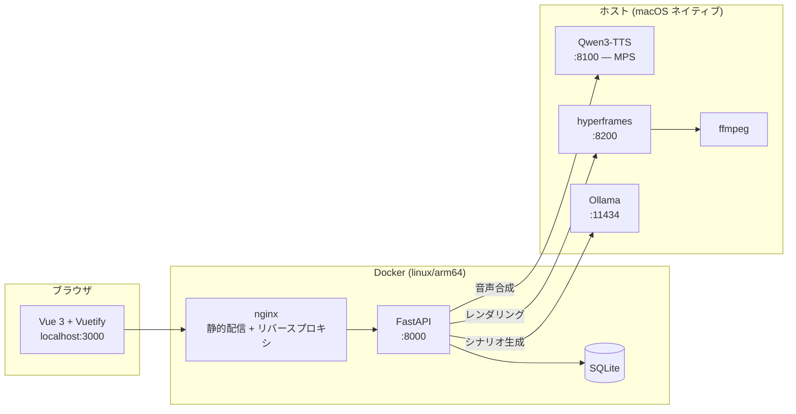

# AI-MovGen — 研修動画の自動生成ツール

PowerPoint やテキストから、**ナレーション音声付きのスライド動画**を自動生成する
ローカル完結型の Web アプリケーションです。

シナリオの構成・原稿の執筆・音声合成・スライドのデザイン・動画のレンダリングまでを
一貫して行います。**文章生成も音声合成もすべてローカルで動作**するため、
資料や原稿が外部のサービスに送信されることはありません。

> **⚠️ このリポジトリはソースコードの公開のみを目的としています。**
> ライセンスは設定していません（詳細は[ライセンス](#ライセンス)を参照）。

---

## 目次

- [できること](#できること)
- [構成](#構成)
- [動作要件](#動作要件)
- [セットアップ](#セットアップ)
- [起動と停止](#起動と停止)
- [使い方](#使い方)
- [設定](#設定)
- [トラブルシューティング](#トラブルシューティング)
- [ディレクトリ構成](#ディレクトリ構成)
- [ライセンス](#ライセンス)

---

## できること

### 3 通りの入力からシナリオを作る

| 入力 | 説明 |
| --- | --- |
| **PPTX 取り込み** | 既存の研修資料を読み込み、スライドごとにシーンを起こす。図表は画像として抽出して配置する |
| **テキスト貼り付け** | 台本や記事を貼り付けて、AI に構成へ分解させる |
| **AI チャット** | 「〇〇の研修動画を作って」と対話しながら構成を組み立てる |

### スライドを 10 種類のレイアウトで描き分ける

`section_header`（章扉） / `bullet_list`（箇条書き） / `comparison`（対比） /
`card_panel`（カード） / `table`（表） / `graph_chart`（グラフ） /
`chat_dialog`（会話） / `image_gallery`（画像一覧） /
`text_left_image_right`（左右 2 段） / `full_image`（全面画像）

内容に応じて AI がレイアウトを選び、HTML と CSS を生成します。
生成結果はエディタで直接手直しできます。

### ナレーションを声質クローンで読み上げる

Qwen3-TTS により、用意した参照音声の声質でナレーションを合成します。
話者を 2 人設定すれば、掛け合い形式の会話シーンも作れます。

### デザインを設定で切り替える

配色 5 色・書体・**背景モチーフ 6 種**・**装飾スタイル 4 種**・
**組版 3 段階**・**シーン切替 5 種**を組み合わせられます。

背景色の明るさから明暗テーマを自動判定し、文字色・境界線・影などの派生色を
自動的に整合させます。文字色と背景色のコントラストが不足する場合は、
読める色へ自動補正します。

完成形のプリセットを 8 種類同梱しています。
「落ち着いた和風にして」のような指示から AI にデザイン一式を提案させることもできます。

---

## 構成



**なぜ TTS とレンダラーだけホスト側で動かすのか**

- **TTS**: Apple Silicon の GPU (MPS) を使うため。コンテナからは GPU が見えない
- **レンダラー**: コンテナ内では GPU が無く SwiftShader にフォールバックして
  大幅に遅くなる（10 秒のコンポジションで 12.2 秒 → 5.1 秒の差を実測）

### 動画が組み立てられるまで

1. `composition.py` がシーン群から `index.html` / `style.css` / `meta.json` を書き出す
2. 各シーンの尺は**合成済み音声の実長**から決まる（原稿の文字数ではない）
3. GSAP のタイムラインを `data-start` / `data-duration` 属性から動的に構築する
4. hyperframes がヘッドレス Chrome でフレームを書き出し、ffmpeg が MP4 に変換する
5. 長い動画は分割してレンダリングし、最後に ffmpeg で無劣化連結する

---

## 動作要件

**macOS (Apple Silicon) 専用**です。以下に依存しています。

- TTS が Metal Performance Shaders (MPS) を前提にしている
- レンダラーが macOS 上のネイティブ Chrome を使う
- 書体としてヒラギノ・游書体など macOS のシステムフォントを参照する
- Docker イメージを `linux/arm64` で構築する

| 必要なもの | 用途 | 導入 |
| --- | --- | --- |
| macOS + Apple Silicon | — | — |
| Docker Desktop | Web アプリ本体 | [公式サイト](https://www.docker.com/products/docker-desktop/) |
| Python 3.10 以上 | TTS / レンダラー | `brew install python@3.12` |
| Node.js | hyperframes の実行 | `brew install node` |
| ffmpeg | 動画のエンコード | `brew install ffmpeg` |
| Ollama | シナリオ・デザインの生成 | [公式サイト](https://ollama.com/) |

メモリは 32GB 以上を推奨します（TTS モデル + ヘッドレス Chrome を
複数ワーカーで動かすため）。

---

## セットアップ

### 1. リポジトリを取得する

```bash
git clone <このリポジトリの URL>
cd heygen
```

### 2. ホスト側の依存を入れる

```bash
brew install ffmpeg node python@3.12
npm install -g hyperframes
```

### 3. ローカル LLM を用意する

```bash
# Ollama をインストールしてからモデルを取得する
ollama pull qwen3:14b
```

別のモデルを使う場合は `.env` の `LOCAL_LLM_MODEL` で指定します。

### 4. TTS サーバーの仮想環境を作る

```bash
cd qwen3-tts
python3 -m venv .venv-host
source .venv-host/bin/activate
pip install -r requirements.txt
deactivate
cd ..
```

初回起動時に Qwen3-TTS のモデル（約 1.2GB）が `data/model_cache/` に
ダウンロードされます。

### 5. レンダラーの仮想環境を作る

```bash
cd mlx
python3 -m venv .venv-host
source .venv-host/bin/activate
pip install -r requirements.txt
deactivate
cd ..
```

### 6. 話者の参照音声を配置する

**この手順は必須です。** 声質クローンの元になる音声はリポジトリに含めていません
（実在する人物の声を含むため）。

```bash
mkdir -p engine/voice_samples/default
# 任意の音声を reference.wav として配置する
cp /path/to/your-voice.wav engine/voice_samples/default/reference.wav
```

- 形式: WAV / 5〜15 秒程度 / 明瞭な発話 / 背景雑音なし
- **必ず本人の音声か、利用許諾のある音声を使ってください。**
  他人の声を無断でクローンすることは避けてください
- 話者はアプリの「話者管理」から追加でき、ブラウザ上での録音にも対応しています

### 7. 環境変数（任意）

```bash
cp .env.example .env
```

すべて既定値があるため、既定のポートで動かす場合は設定不要です。

---

## 起動と停止

```bash
bash start.sh            # ビルドして一括起動
bash start.sh --no-build # ビルドを省略して起動
bash start.sh --logs     # 起動後にログを追跡
bash stop.sh             # 停止
```

`start.sh` は TTS・レンダラー・Docker コンテナをまとめて起動し、
すべてのヘルスチェックが通るまで待機します。

起動したら <http://localhost:3000> を開きます。

| ポート | サービス |
| --- | --- |
| 3000 | Web アプリ |
| 8100 | TTS サーバー（ホスト） |
| 8200 | レンダラー（ホスト） |
| 11434 | Ollama（ホスト） |

---

## 使い方

### 1. プロジェクトと動画を作る

ホーム画面でプロジェクトを作成し、その中に動画を追加します。

### 2. シーンを作る

「シナリオ」タブで、PPTX 取り込み・テキスト貼り付け・AI チャットの
いずれかから構成を作ります。生成後は各シーンの原稿・レイアウト・
画像を個別に編集できます。

### 3. 話者を設定する

「話者」タブで、ナレーションを読み上げる話者を選びます。
参照音声をアップロードするか、ブラウザ上で録音して登録します。
会話形式のシーンでは話者を 2 人設定できます。

### 4. スタイルを設定する

「スタイル」タブで配色・書体・背景・質感・組版・切替を設定します。
変更は自動保存され、右側のプレビューに即座に反映されます。

### 5. 生成する

「生成」タブから動画を作成します。進捗は WebSocket で実時間に配信されます。
一度合成した音声はキャッシュされるため、**原稿を変えていないシーンは
再生成時に音声合成をスキップ**します。

---

## 設定

アプリの「設定」画面、または `.env` で変更できます。
主なものは `webapp/backend/core/config.py` にまとまっています。

| 項目 | 既定値 | 説明 |
| --- | --- | --- |
| `default_fps` | 24 | フレームレート。スライド主体なら 30 との差はほぼ分からず、フレーム数を 20% 削減できる |
| `render_workers` | 4 | 並列ワーカー数。Chrome 1 プロセスあたり約 256MB を消費する |
| `render_chunk_sec` | 300 | この秒数を超える動画は分割してレンダリングする |
| `tts_max_chunk_chars` | 120 | TTS の分割文字数。**この値を大きくしないこと**（下記参照） |
| `tts_batch_size` | 4 | TTS のバッチサイズ。遅い場合は 1 に戻す |

> **TTS の分割文字数について**
> Qwen3-TTS は長文を一度に投げると EOS を出せず、雑音を生成し続けて破綻します。
> 実測では 128〜142 文字帯は破綻ゼロ、260 文字超から破綻し始めました。
> 既定の 120 文字は安全側に倒した値です。

---

## トラブルシューティング

### 動画が静止画になる / アニメーションが効かない

コンポジションのディレクトリに `app.js` / `gsap.min.js` / `chart.min.js` が
揃っているか確認してください。hyperframes は JS の 404 をエラーにせず完走するため、
**静止画の動画が「成功」として出力されます**。
`services/composition.py` の `find_missing_local_refs()` が
レンダリング前に検出して停止させます。

### 書体が指定と違う

`style.css` が読む `fonts/*.woff2` が出力先に無いと、無言でシステムフォントに
差し替わります。`find_missing_css_refs()` が警告を出すので、
レンダリングログを確認してください。

### 音声合成の途中で "Server disconnected" になる

TTS サーバーがメモリ不足で OS に強制終了されています。
`tts_batch_size` を 1 に下げるか、他のアプリを終了してください。

### hyperframes が見つからない

```bash
npm install -g hyperframes
```

なお hyperframes の自己更新は無効化しています。レンダリング中に
パッケージが入れ替わると `Missing manifest` で失敗するためです。
更新は動画生成をしていないときに手動で行ってください。

---

## ディレクトリ構成

```
.
├── webapp/
│   ├── backend/            FastAPI バックエンド
│   │   ├── routers/        API エンドポイント
│   │   ├── services/       ドメインロジック
│   │   │   ├── composition.py    コンポジション (HTML/CSS) の生成
│   │   │   ├── design_tokens.py  デザイントークンと配色の導出
│   │   │   ├── tts_service.py    音声合成
│   │   │   └── llm_service.py    シナリオ・デザインの生成
│   │   ├── workers/        レンダリングワーカー
│   │   └── models/         SQLAlchemy モデル
│   └── frontend/           Vue 3 + Vuetify
├── templates/blank/        スライドのテンプレート (HTML/CSS/JS/フォント)
├── qwen3-tts/              TTS サーバー (ホスト実行)
├── mlx/                    レンダラーサーバー (ホスト実行)
├── engine/                 PPTX 解析・話者音声
├── docs/                   要件定義と設計判断の記録
├── projects/               生成された動画 (git 管理外)
└── data/                   SQLite DB・ログ・モデルキャッシュ (git 管理外)
```

`docs/` には開発中の設計判断を `antigravity_fixNN_*.md` として記録しています。
何をなぜそう実装したかの経緯はそちらを参照してください。

---

## ライセンス

**このリポジトリにライセンスは設定していません。**

したがって著作権法上の既定が適用され、著作者がすべての権利を留保します。
ソースコードの閲覧を目的とした公開であり、複製・改変・再配布・利用の許諾は
行っていません。利用をご希望の場合は個別にご連絡ください。

### 同梱している第三者のソフトウェア

以下は各配布元のライセンスに従います。当リポジトリの方針とは独立しています。

| 名称 | 用途 | ライセンス |
| --- | --- | --- |
| [BIZ UDPGothic](https://github.com/googlefonts/morisawa-biz-ud-gothic) | スライドの書体 | SIL Open Font License 1.1（`templates/blank/fonts/OFL.txt`） |
| [GSAP](https://gsap.com/) | アニメーション | GreenSock 標準ライセンス |
| [Chart.js](https://www.chartjs.org/) | グラフ描画 | MIT License |

### 利用している外部モデル・ツール

| 名称 | 用途 |
| --- | --- |
| [Qwen3-TTS](https://huggingface.co/Qwen) | 音声合成 |
| [Ollama](https://ollama.com/) | ローカル LLM の実行 |
| [hyperframes](https://www.npmjs.com/package/hyperframes) | HTML からの動画レンダリング |

### 声の取り扱いについて

本ツールは参照音声から声質を複製します。
**必ず本人の音声か、明示的な利用許諾のある音声のみを使用してください。**
生成した音声を、実在の人物の発言であるかのように提示する用途には使わないでください。
